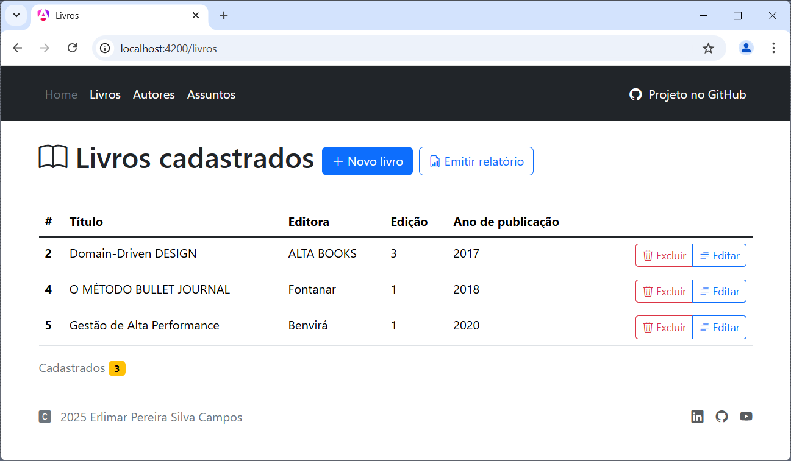

# Desafio TJRJ - Erlimar Silva Campos - 2025


Este repositório contém os artefatos de desenvolvimento para desafio proposto por TJRJ 
cujo objetivo é criar um projeto utilizando as boas práticas de mercado e apresentar o
mesmo demonstrando o passo a passo de sua criação (base de dados, tecnologias, aplicação,
metodologias, frameworks, etc).



- **frontend** - diretório com projeto _front-end_ em [Angular][ANGULAR]
- **backend** - diretório com projeto _back-end_ em [ASP.NET Core][ASPNETCORE]
- **eng** - diretório com scripts e artefatos de infraestrutura para execução do projeto
em containers usando [Docker Compose][DOCKERCOMPOSE]

Você deve encontrar mais informações com relação a cada projeto em seus respectivos
subdiretórios.

# Prepare seu ambiente de desenvolvimento

## Pré-requisitos

- [.NET SDK 8.0][DOTNETSDK]
- [Node.js v22 com NPM][NODEJS]
- [MS SQL Server Express 2022][MSSQL] ou [Docker com Compose][DOCKERCOMPOSE]
- [FastReport Designer Community Edition 2025][FASTREPORTDESIGNER]
- [Terminal com PowerShell][POWERSHELL]

> Este repositório foi projetado de forma que o _front-end_ e o _back-end_ sejam desenvolvidos
> de forma isolada e não integrada, ou seja, você deve abrir cada projeto separadamente em seus
> respectivos subdiretórios, ao invés de abrir este diretório raiz para desenvolvê-los em
> conjunto.
> 
> Porém, se estiver usando o [Visual Studio Code](https://code.visualstudio.com) você
> pode abrir o arquivo `desafio-tjrj-erlimar-2025.code-workspace` com o recurso de
> [Multi-root workspaces](https://code.visualstudio.com/docs/editor/workspaces/workspaces)
> para uma melhor experiência de desenvolvimento.
> 
> Também recomendamos fortemente que instale todas as extensões marcadas como recomendações
> no próprio arquivo de _Workspace_.

## Passo a passo inicial

> Em um terminal [PowerShell][POWERSHELL], esteja no diretório raiz do projeto

1. Inicializa o setup dos requisitos de desenvolvimento
```powershell
# Essa operação irá gerar o arquivo com variáveis de ambiente e scripts de criação
# do banco de dados, e só precisa ser feita uma única vez
.\setup.ps1
```

2. Levante os serviços de dependências de desenvolvimento
```powershell
# Isso deve levantar uma instância do MS SQL Server Express na porta 11433
# A senha para o usuário "sa" estará disponível no arquivo infra/dev.env
# e com ela você poderá acessar a base em sua ferramenta preferida
.\up.ps1

# Caso queira acompanhar o status dos serviços do Docker
.\stats.ps1
# Um [Ctrl + C] encerra

# Quando terminar pode encerrar os serviços de dependências
.\down.ps1
```

3. Conecte-se ao servidor de banco e crie a base da aplicação

- Você encontrará a senha do usuário `sa` no arquivo `infra/dev.env`
- Uma vez conectado crie a base de dados da aplicação executando o arquivo `infra/db_scripts/create_database.sql`
- No próprio arquivo `infra/db_scripts/create_database.sql` você encontra o nome da base, usuário e senha para usar na _WebApi_
- Agora você pode usar apenas a conexão com o novo usuário exclusivo da aplicação

4. Aplique o script que cria o esquema do banco

- Script disponível em `infra/db_scripts/database_apply.sql`

5. Restaure as dependências de pacotes dos projetos
```powershell
.\restore.ps1
```

6. Execute a aplicação no modo desenvolvimento

- No Visual Studio Code, abra o arquivo de _Workspace_ `desafio-tjrj-erlimar-2025.code-workspace`
- Na aba "Run and Debug" escolha a opção **All-In-One (workspace)** e dê um play

<!-- links -->
[ANGULAR]: https://angular.io
[ASPNETCORE]: https://asp.net
[DOCKERCOMPOSE]: https://docs.docker.com/compose/
[DOTNETSDK]: https://dotnet.microsoft.com/pt-br/download/dotnet/8.0
[NODEJS]: https://nodejs.org/pt
[MSSQL]: https://www.microsoft.com/pt-br/sql-server/sql-server-2022
[FASTREPORTDESIGNER]: https://fastreports.github.io/FastReport.Documentation/FastReportDesignerCommunityEdition.html
[POWERSHELL]: https://learn.microsoft.com/pt-br/powershell/